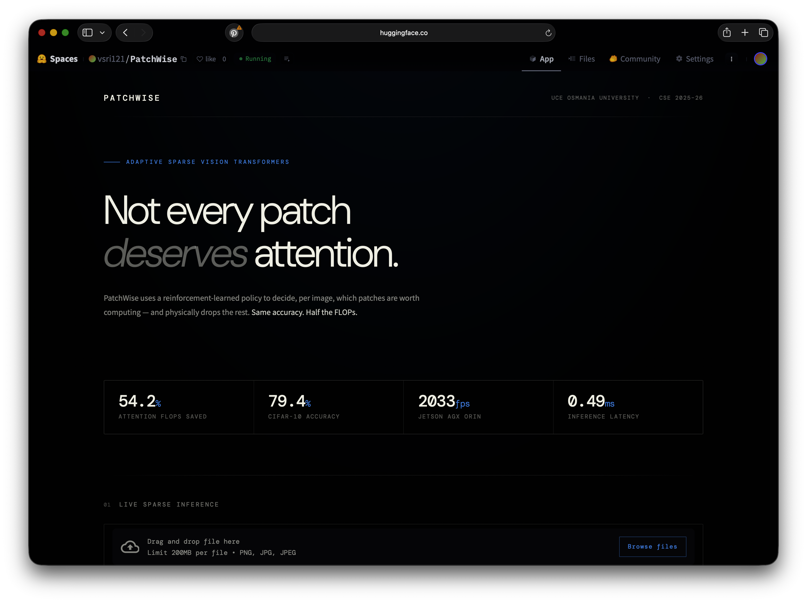
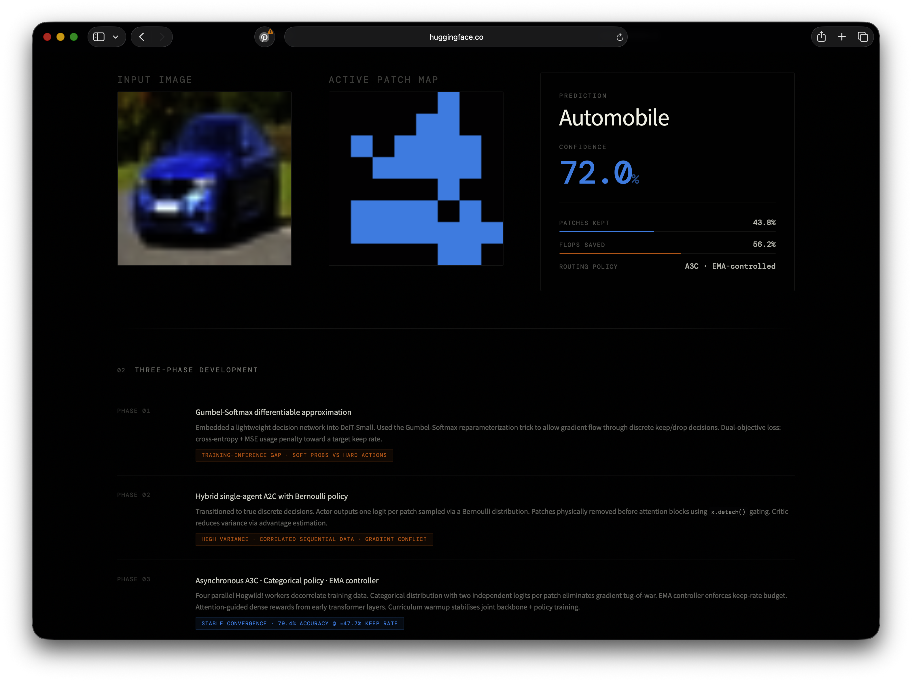

# PatchWise

An AI-powered skin condition analysis assistant that helps users identify possible skin concerns from images and receive informative insights through an interactive web interface.

---

## Live Demo

Try it here: https://huggingface.co/spaces/vsri121/PatchWise

---

## Overview

PatchWise is a Streamlit-based AI application designed to analyze uploaded skin images and provide predictions using a deep learning model. The goal of the project is to create an accessible and user-friendly platform for preliminary skin condition awareness using AI.

Users can:
- Upload an image
- Get AI-generated predictions
- View results instantly through an intuitive interface
- Interact with a lightweight and responsive web app

---

## Tech Stack

- Python
- Streamlit
- PyTorch
- Transformers / Deep Learning Models
- Hugging Face Spaces
- Git & GitHub

---

## Features

- Image upload support
- AI-powered prediction pipeline
- Fast inference and responsive UI
- Cloud deployment with Hugging Face Spaces
- Deep learning integration
- Clean and interactive interface

---

## Screenshots

### Home Page



---


### Prediction Results



---

## Project Structure

```bash
PatchWise/
│
├── app.py
├── requirements.txt
├── screenshots/
│   ├── home.png
│   ├── upload.png
│   └── prediction.png
├── utils.py
└── README.md
```

---

## Installation

Clone the repository:

```bash
git clone https://github.com/vsri121/PatchWise.git
cd PatchWise
```

Install dependencies:

```bash
pip install -r requirements.txt
```

Run the application locally:

```bash
streamlit run app.py
```

---

## How It Works

1. User uploads a skin image
2. The image is preprocessed
3. The AI model performs inference
4. Predictions are displayed in real time
5. Users receive informative results instantly

---

## Motivation

PatchWise was built to explore the intersection of:
- Artificial Intelligence
- Healthcare assistance
- Computer Vision
- Accessible AI applications

The project also provided hands-on experience with:
- Model deployment
- Streamlit app development
- Hugging Face Spaces
- Debugging production environments
- End-to-end AI workflows

---

## Future Improvements

- Multi-condition classification
- Improved model accuracy
- Better UI/UX enhancements
- Medical report generation
- Mobile optimization
- User authentication and history

---

## Acknowledgment

This project was developed under the guidance of Prof. P. V. Sudha, Professor, Department of Computer Science and Engineering, University College of Engineering Osmania University.

---

## Contributing

Contributions, suggestions, and feedback are welcome.

Feel free to fork the project and submit pull requests.

---

## Disclaimer

PatchWise is intended for educational and informational purposes only and should not be considered a substitute for professional medical advice or diagnosis.

---

## Author

Built by Varsha S.
